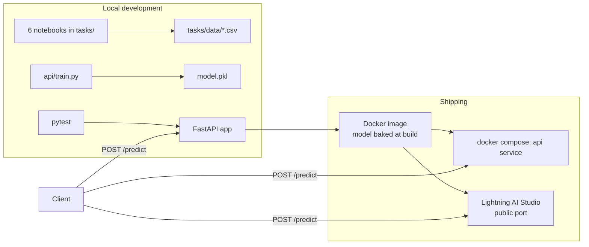

# Customer Churn Analysis and Prediction — Telco

Saiket Systems ML internship project: analyze customer churn for a
telecommunications company and serve a predictive model behind an API.
Work covers all 6 project tasks (only 4 required) plus production
packaging (API, Docker, Compose, tests) and a live cloud deployment.

## Overview

A telecom company loses ~26% of its customers. This project predicts
which customers are about to leave so the company can retain them with
targeted offers. Success means high **recall on churners**, not just
overall accuracy. The final LogisticRegression model catches 78% of
churners (ROC-AUC 0.842) and is served via FastAPI locally, via Docker,
and on a public cloud URL.

## Architecture



Request flow inside the service: JSON → Pydantic validation →
DataFrame (feature order from artifact) → ColumnTransformer
(StandardScaler + OneHot) → LogisticRegression → `{churn, label,
probability}`.

## ML Pipeline

1. **Load & clean:** 7043×21; 11 blank `TotalCharges` (all `tenure == 0`
   new customers) coerced to NaN and filled with **0** (median 1397 would
   fabricate charges); 0 duplicates; 0 IQR outliers.
2. **Prepare:** drop `customerID` (identifier) and `gender` (churn gap
   0.76pp, no signal); keep `No internet service` levels as informative.
3. **Encode:** OneHotEncoder ×14 categoricals + StandardScaler ×4
   numerics → 43 features; target Yes=1/No=0.
4. **Split:** stratified 80/20 (`random_state=42`), preprocessor fit on
   train only (train 5634, test 1409).
5. **Select:** LogisticRegression baseline vs RandomForest comparator,
   both as leakage-safe pipelines.
6. **Evaluate:** 5 metrics + confusion matrices + ROC + feature
   importance + 5-fold CV + GridSearchCV tuning.

## Results

| model | accuracy | precision | recall | F1 | ROC-AUC |
|---|---|---|---|---|---|
| LogisticRegression | 0.737 | 0.503 | **0.783** | **0.613** | **0.842** |
| RandomForest | 0.779 | 0.603 | 0.484 | 0.537 | 0.821 |

Final model: **LogisticRegression** (catches 78% of churners vs 48%).
CV: LogReg AUC 0.845±0.013 vs RF 0.821±0.013. Tuning: `C=10` → 0.846;
RF `max_depth=10` → 0.843. Top drivers: tenure −1.15, Two-year −0.78,
Fiber optic +0.70, MonthlyCharges −0.67, Month-to-month +0.65.

## API

FastAPI app in `api/app.py`:

- `GET /health` → liveness + model info (`model`, `n_features`) or
  `degraded` when unavailable.
- `POST /predict` → churn prediction with Pydantic validation
  (422 on bad input, 503 when model missing, clean 500s otherwise).
- Model loads once at startup (lifespan) with INFO logging; decision
  threshold configurable via `CHURN_THRESHOLD` (default 0.5).
- Interactive docs at `/docs`.

## Model Serving

`api/train.py` reproduces the notebook cleaning, trains the winning
pipeline on the full dataset (7043×18) and saves `model.pkl`
(`{pipeline, feature_order}`, ~7 KB). The Docker image retrains at
build time, so no stale artifacts are ever served.

## API Usage

```bash
cd api
python train.py
uvicorn app:app --reload        # docs: http://127.0.0.1:8000/docs
```

### Example Request

```bash
curl -X POST http://127.0.0.1:8000/predict \
  -H "Content-Type: application/json" -d '{
    "SeniorCitizen": 0, "Partner": "Yes", "Dependents": "No", "tenure": 1,
    "PhoneService": "No", "MultipleLines": "No phone service",
    "InternetService": "DSL", "OnlineSecurity": "No", "OnlineBackup": "Yes",
    "DeviceProtection": "No", "TechSupport": "No", "StreamingTV": "No",
    "StreamingMovies": "No", "Contract": "Month-to-month",
    "PaperlessBilling": "Yes", "PaymentMethod": "Electronic check",
    "MonthlyCharges": 29.85, "TotalCharges": 29.85}'
```

### Example Response

```json
{"churn": 1, "churn_label": "Yes", "churn_probability": 0.8193}
```

## Docker

Production-oriented `api/Dockerfile` (build context = repo root):
python:3.11-slim, pinned requirements, non-root `appuser`, `HEALTHCHECK`
on `/health` (port-aware), `PYTHONUNBUFFERED=1`, port via
`${PORT:-8000}`, model trained during build (~692 MB image).

```bash
docker build -f api/Dockerfile -t churn-api .
docker run -d --name churn-api -p 8000:8000 churn-api
```

## Docker Compose

Single `api` service (no invented services — one container is genuinely
enough): build from the Dockerfile, port 8000, `PORT` via environment,
`restart: unless-stopped`.

```bash
docker compose up -d --build
docker compose ps        # expect Up (healthy)
docker compose down
```

## Testing

`api/tests/` — 16 pytest tests, all passing
(`pip install -r api/requirements-dev.txt`, then
`python -m pytest api/tests -v`, ~2 s), deterministic, no external
services: health (+model details), response schema, flagged customer → 1,
low-risk → 0, 2×422 rejections, unknown-category tolerance,
missing-model 503, degraded health, corrupt-model 500, threshold env
override, artifact structure, bounded probabilities, risk ordering.

## Demo UI (Streamlit)

`ui/streamlit_app.py` — interactive demo for non-technical visitors:
form with the same 18 fields and exact training categories, served by
the same `model.pkl` as the API (no duplicated logic). Defaults mirror
dataset row 0, so the first click reproduces the API result (`81.9%`).

```bash
pip install -r ui/requirements.txt
streamlit run ui/streamlit_app.py   # http://localhost:8501
```

## Deployment

Live public deployment on **Lightning AI** (Studio + public port):

- **Public URL:** `https://8000-01m30cq40y1jk4dvz9xr1cycms.cloudspaces.litng.ai`
- **Verified remotely:** `/health` → ok + model info; `/docs` → 200;
  `/predict` → identical `0.8193` as local and Docker runs.
- **Redeploy:** in the Studio terminal: `git pull`, `python train.py`,
  `uvicorn app:app --host 0.0.0.0 --port 8000`; the URL is stable per Studio.
- Honest note: Studio-based hosting sleeps when idle; for an
  always-on service, Lightning's container deploy (same Dockerfile) is
  the next step.

## Cloud evaluation notes

Render and Koyeb were evaluated first: Render's signup flow demanded a
card for this account and Koyeb paused onboarding during its Mistral
transition, so Lightning AI (free CPU quota, no card) became the target
and was verified end-to-end. The repo stays cloud-agnostic: `render.yaml`
(Render-ready: Dockerfile path, `$PORT`, `/health` check) is included,
and the same image runs anywhere Docker runs.

## Project Structure

```
├── README.md  render.yaml  docker-compose.yml  .dockerignore
├── api/
│   ├── app.py  train.py  requirements.txt  Dockerfile  model.pkl
│   └── tests/ (conftest, test_api, test_model)
├── ui/
│   └── streamlit_app.py  requirements.txt
└── tasks/
    ├── Telco_Customer_Churn_Dataset.csv
    ├── Task1_..._Task6_*.ipynb
    └── data/ (df_task1, df_task3, X, y + train/test splits)
```

## Technologies

Python 3.11 · scikit-learn 1.8.0 · pandas 3.0.3 · FastAPI 0.141.1 ·
uvicorn 0.53.0 · pydantic 2.13.5 · pytest 8.3.3 · Streamlit 1.58.0 ·
Docker 29.8 · Lightning AI (deploy) · Render-ready config.
